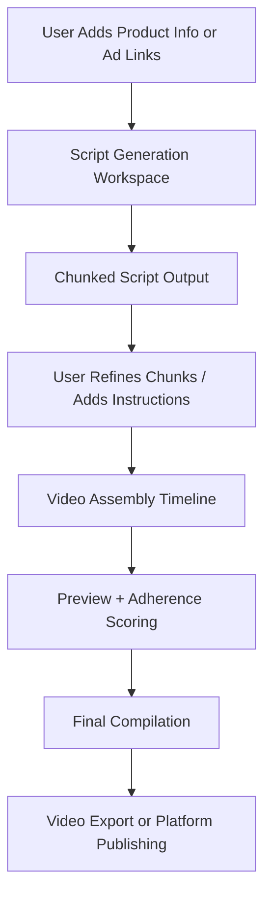

# 📘 Short-Form Video Ad Creation Platform - Full Stack & Architecture

This document outlines the complete functionality, architecture, and recommended tech stack for the **Short-Form Video Ad Creation Platform**, broken into distinct workspaces:

* **Script Generation Workspace**
* **Video Assembly Workspace**
* **Shared Infrastructure**
* **SVG Timeline and Chunk System**

It is designed to be an evolving reference for technical planning and product development.

---

## 🧭 WORKSPACES OVERVIEW

### 1. **Script Generation Workspace**

* Node-based and text-based script authoring system that uses AI to generate and refine ad scripts.
* Two modes:

  * **Graph View**: visually connect Product Specs, Ads, and Instructions into the Script Generator
  * **Static View**: edit AI-generated scripts in a professional editor with integrated AI assistant

### 2. **Video Assembly Workspace**

* Timeline-based, chunk-driven video editor for assembling, comparing, and exporting video variations.
* Modular design for building videos from Hooks, Product segments, and CTAs.

---

# ✍️ SCRIPT GENERATION WORKSPACE

## 🔹 Graph View (Node-Based Scripting)

* Visual workspace for linking content sources into the Script Generator
* Nodes: Product Spec, Ad Example, Instruction, Script Generator
* AI output: 1–3 variations of chunked scripts (Hook, Body, CTA)
* **Ad Nodes** can be expanded to preview the full video inline (embed or local playback), available in both Graph and Static views

## 🔹 Static View (Chunk-Based Script Editor)

### 🧭 Layout Structure

* **Left Sidebar**: Organized into three collapsible sections:

  1. **Advertisements** — with video preview for each (selectable to include in context)
  2. **Product Specs** — structured data or docs
  3. **Instructions** — brand guidelines, CTA formats, tone guides

* **Middle Panel**: Chunk-Based Rich Text Editor

  * Appears only after a script has been generated
  * The script is displayed in modular **chunks**
  * Each chunk includes:

    * **Script Text** (editable)
    * **Camera Direction** (editable metadata for production)
  * Users can:

    * Reorder chunks
    * Edit within chunks
    * Select one or more for revision with AI assistant

* **Right Sidebar**: Collapsible AI Assistant Panel

  * Chat interface similar to Cursor or GitHub Copilot Chat
  * Users can:

    * Ask for rewrites
    * Request new chunks (e.g., "add a hook before this")
    * Add/Delete/Regenerate specific sections
    * Context awareness:

      * Clicking nodes in the left sidebar **adds that node’s content to chat context**
      * Deselecting removes it
    * This context affects the assistant’s rewriting behavior

### 🖼️ Frontend Stack: Script Workspace

| Component          | Stack                                                                            |
| ------------------ | -------------------------------------------------------------------------------- |
| UI Framework       | React + Vite                                                                     |
| Styling            | Tailwind CSS + Headless UI                                                       |
| Graph View         | `react-flow` + SVG custom styling                                                |
| Rich Text Editor   | TipTap or Lexical (chunk-aware zones + dual-field chunks)                        |
| State Management   | Zustand (sync Graph, Static views, and sidebar states)                           |
| AI Assistant       | Cursor-like chat UI powered by GPT/Claude APIs                                   |
| Media Preview      | `<video>` tag for Ad previews; conditional embed support (YouTube, TikTok, etc.) |
| Context Management | Click tracking for source selection + temporary chat context injection           |

### 💾 Backend Stack: Script Workspace

| Component           | Stack                                                                            |
| ------------------- | -------------------------------------------------------------------------------- |
| API Framework       | FastAPI or Node.js (Express)                                                     |
| LLM Integration     | GPT-4o / Claude API via LangChain or custom prompt service                       |
| Script Generation   | Prompt orchestration + chunk formatting logic                                    |
| Context Aggregation | Real-time context collector from left sidebar selection (ad, spec, instruction)  |
| Media Ingest        | Ad URL embed fetcher, metadata fetcher, or file-based video handler              |
| Storage             | PostgreSQL (script structure), S3 (video previews), Firestore (script snapshots) |

---

# 🎬 VIDEO ASSEMBLY WORKSPACE

## 🔹 Features

* Users build videos by selecting and stacking **video chunks** (Hook / Product / CTA)
* Each chunk can have multiple variations
* Real-time preview of assembled paths
* AI scoring for script adherence
* Export to final video via FFmpeg

### 🖼️ Frontend Stack: Video Workspace

| Component          | Stack                                                       |
| ------------------ | ----------------------------------------------------------- |
| Timeline UI        | SVG Timeline Component (static layout, interactive visuals) |
| Chunk Nodes        | React component system (with `<video>` preview support)     |
| Video Preview      | Blob URL preview generation, `<video>` tag rendering        |
| Chunk Upload       | File upload component to S3 or Cloudflare Stream            |
| State Management   | Zustand (timeline sync, variation stacking)                 |
| Adherence Feedback | Trigger `/rate-clip` and show scored output per chunk       |
| Modal Editing      | Headless UI or Radix modal for in-place video editing       |

### 💾 Backend Stack: Video Workspace

| Component              | Stack                                                                                           |
| ---------------------- | ----------------------------------------------------------------------------------------------- |
| Chunk Scoring          | `/rate-clip` using Whisper + LLM prompt comparison                                              |
| Final Export           | FFmpeg pipeline (Dockerized) for stitching chunks with transitions, applying trim/crop metadata |
| Preview Generation     | Lightweight FFmpeg (or client-side Blob stitching)                                              |
| Embedding/Asset Lookup | Sentence-transformers → Weaviate or Pinecone                                                    |
| Storage                | S3-compatible bucket for all videos and exports                                                 |
| Job Queues             | BullMQ (Node) or Celery (Python) for rendering + AI scoring                                     |

---

# 🧩 SVG TIMELINE AND CHUNK SYSTEM

### 🔹 Timeline UX Summary

* Each **column** = a script chunk type (Hook, Product Shot 1, Product Shot 2, CTA)
* Each **box** = one video chunk variant
* The **top row** in each column = the selected main video path
* Lines connect the selected top chunks across the timeline
* Vertical "➕" buttons add more variants under each stage

### 🔹 Chunk Nodes

Each video chunk node contains:

| Property            | Description                                                 |
| ------------------- | ----------------------------------------------------------- |
| `type`              | One of `hook`, `product`, `cta`                             |
| `videoVariants`     | Array of uploaded/recorded videos for this chunk            |
| `scriptText`        | Text associated with the chunk (for reference or adherence) |
| `score`             | Optional AI adherence score per variant                     |
| `thumbnail`         | Preview frame or uploaded image                             |
| `selectedVariantId` | Current version selected for assembly path                  |

### 🔹 Focused Path Behavior

* Only the **currently selected path** is **highlighted** with colored connection lines
* Nodes on this path are **slightly enlarged** (e.g., scale 1.1x)
* All other variant nodes are **grayed out** but still interactable

### 🔹 Video Node Editing Modal

* **Double-click** a chunk node to open an editing popup
* Features inside modal:

  * Trim start and end (via slider or timestamps)
  * Adjust visible area of video (crop within fixed 9:16 ratio)
  * Upload/replace video variant
  * Add labels or version notes
* On save, updates local chunk state
* Final trim/crop instructions passed to FFmpeg via:

```bash
ffmpeg -i input.mp4 -ss {start} -to {end} -filter:v "crop=w:h:x:y"
```

### 🔹 SVG Timeline Stack

| Component        | Description                                                     |
| ---------------- | --------------------------------------------------------------- |
| TimelineCanvas   | SVG wrapper that renders all chunk boxes and curved connections |
| ChunkColumn      | Fixed column for a chunk type                                   |
| ChunkNode        | Video variant block with thumbnail + controls                   |
| ConnectionLine   | Bezier curve connecting selected nodes from column to column    |
| AddVariantButton | Adds a new chunk variant to the column                          |
| ZoomSlider       | Optional control for scaling the SVG view                       |
| Node Modal       | Popup for in-place editing of chunk trim, position, metadata    |

### 🔹 Rendering Logic

Use `M, C` commands to create cubic Bezier connections:

```tsx
<path d={`M${x1},${y1} C${cx1},${y1} ${cx2},${y2} ${x2},${y2}`} />
```

Highlight top-level path with thicker glow; dim unused variants. Interactivity includes hover previews and click-to-select.

---

# 🧠 SHARED SYSTEMS & INFRASTRUCTURE

### ✅ Shared Endpoints

1. **/analyze-ad** – Ingest TikTok/IG/YT link → detailed JSON (transcript, visuals)
2. **/generate-script** – Generate chunked scripts from JSON ads + product specs
3. **/rate-clip** – Score how well a video clip adheres to chunk instructions
4. **/embed-asset** – Store embedded video segments in a vector DB for future reuse
5. **/compile-video** – Stitch selected video chunks into a single final export
6. **/generate-preview** – Assemble a preview version of selected chunk path
7. **/suggest-assets** – Retrieve best asset matches for a given chunk description
8. **/save-project** – Save script + timeline state, layout, and versions

### 🌐 Shared Backend Stack

| Layer         | Stack                                                       |
| ------------- | ----------------------------------------------------------- |
| LLM Stack     | OpenAI or Claude via LangChain / custom routing layer       |
| Transcription | Whisper API                                                 |
| Vector DB     | Weaviate, Pinecone, or Milvus for semantic clip search      |
| Project DB    | PostgreSQL + Redis cache                                    |
| Storage       | S3-compatible storage for assets + exports                  |
| Auth          | Supabase Auth, Clerk.dev, or Firebase Auth (for team roles) |

### 🧠 Shared Frontend Components

* Navigation sidebar with project selection
* Global dark/light theme support
* Shared upload manager
* Version control logic (saved script versions, chunk state diffs)
* Global undo/redo layer

---

## 🔁 SYSTEM FLOW (Unified)



---

## 📈 FUTURE EXPANSIONS

* Publish-to-platform support (TikTok, Meta Ads)
* A/B test performance dashboards
* UGC marketplace integrations (on-demand clip sourcing)
* Real-time team collaboration (commenting + presence via yjs)
* AI voiceover and avatar synthesis modules
* Templated graph structures for vertical-specific formats (e.g., beauty, SaaS, fashion)

---

Let me know what else you'd like documented:

* Database schema for projects/chunks?
* Component tree for frontend structure?
* AI prompt routing logic?
* Cloud deployment & scaling plans?
